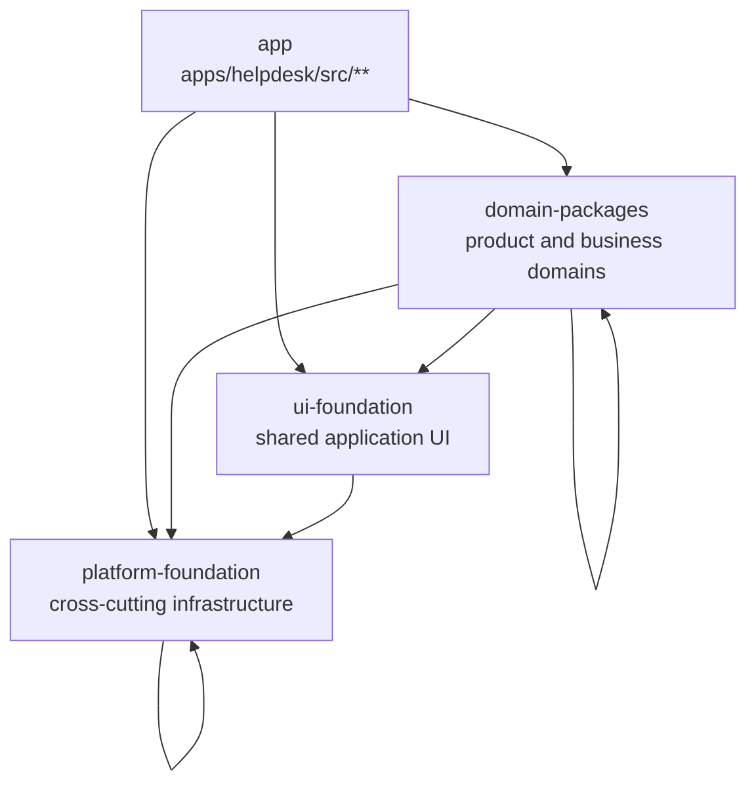

# Architecture

The Helpdesk web app is a PNPM/Nx monorepo in transition from a historically monolithic React/Redux application to internal packages with explicit ownership and import boundaries.

The target is not a micro-frontend architecture. `apps/helpdesk` remains the single host application, and package code is compiled into that app through normal workspace dependencies.

## Goals

- Separate product domains and shared foundations into explicit packages.
- Make ownership clearer through package paths and `CODEOWNERS`.
- Let Nx run quality checks only for affected projects in local workflows and CI.
- Keep migration gradual so feature teams can continue shipping while code moves out of the legacy app tree.

## Why It Matters

The boundary model exists to keep dependencies flowing in one direction: application and domain code may depend on shared foundations, but shared foundations must not depend on product-specific code.

This matters because dependencies should point toward stable, reusable code. When lower-level packages start importing higher-level product concerns, shared modules become secretly domain-specific, ownership becomes unclear, and small changes become harder to reason about. A unidirectional graph keeps packages independently testable, makes migrations safer, and lets Fallow and Nx enforce boundaries and affected-task execution with useful signal.

## Workspace Layout

The PNPM workspace is defined in `pnpm-workspace.yaml`:

```text
apps/helpdesk      Host Helpdesk application.
config             Shared repository tooling and test configuration.
packages/*         Internal monorepo packages.
```

The current repository has one app, the shared `config` workspace, and 31 internal packages under `packages/*`.

Most new or migrated reusable code should live in a package. Some domain code still lives under `apps/helpdesk/src`, which means the repository is mid-migration rather than fully package-oriented. Existing app code should be moved vertically, one owned domain or utility area at a time.

## Package Model

Packages are private internal packages. They are consumed with `workspace:*` dependencies in `package.json`, not published to a registry.

Packages are also the boundary for code that follows current frontend best practices. New or migrated package code should use Vitest for tests, avoid the legacy Redux data store, and rely on the internal typed SDK families such as `@gorgias/*-queries` for server data access.

Package categories today are:

- Domain packages: product and business areas such as `tickets`, `reporting`, `ai-agent`, `billing`, `customer`, `ecommerce`, `teams`, `views`, `voice`, and related domain packages.
- UI foundation packages: application UI and layout building blocks such as `ui`, `forms`, `layout`, `navigation`, and `debug`.
- Platform foundation packages: low-level or cross-cutting infrastructure such as `utils`, `hooks`, `routing`, `permissions`, `logging`, `feature-flags`, `browser-storage`, `api-resources`, `testing`, `types`, and `config`.

The host app should compose packages. Foundation packages should not learn about product domains. Domain packages may depend on foundations and, when necessary, other domain packages, but cross-domain dependencies should remain explicit in package manifests and should not become hidden deep imports.

## Boundary Enforcement

Fallow is configured in `.fallowrc.json` and is the architecture boundary guardrail.

It scans the workspace roots `config`, `apps/**`, and `packages/**`.

The active Fallow zones are:

| Zone | Paths | Purpose |
| --- | --- | --- |
| `app` | `apps/helpdesk/src/**` | Host application and legacy unmigrated code. |
| `domain-packages` | Domain package `src/**` paths | Product and business domain code. |
| `ui-foundation` | UI/layout package `src/**` paths | Shared application UI primitives and composition helpers. |
| `platform-foundation` | Config and low-level package `src/**` paths | Cross-cutting infrastructure and utilities. |

Allowed imports are:

| From | May import |
| --- | --- |
| `app` | `domain-packages`, `ui-foundation`, `platform-foundation` |
| `domain-packages` | `domain-packages`, `ui-foundation`, `platform-foundation` |
| `ui-foundation` | `platform-foundation` |
| `platform-foundation` | `platform-foundation` |



`boundary-violation` is configured as an error. Run `pnpm platform:architecture:boundaries` to check boundary violations with Fallow.

## Task Orchestration

Nx is the task orchestrator. Root scripts such as `test:affected`, `typecheck:affected`, `lint:code:affected`, and `format:check:affected` use the package graph to run only the work affected by a change.

CI uses the same model: the Helpdesk app remains heavily sharded, while affected non-app packages can be tested, linted, typechecked, and reported independently. This is the practical payoff of the monorepo migration: stronger package boundaries make CI faster and create room for broader testing.

## Migration Guidance

When adding or moving code:

- Prefer a package when the code is reusable, owned by a domain, or needed outside one legacy app folder.
- Keep package APIs intentional and narrow; expose domain concepts instead of broad implementation shapes.
- Add explicit `workspace:*` dependencies instead of relying on path reach-through.
- Keep platform foundation code domain-agnostic.
- Keep UI foundation code product-agnostic.
- Treat app-local code as either host composition or legacy code waiting for an owned package migration.
